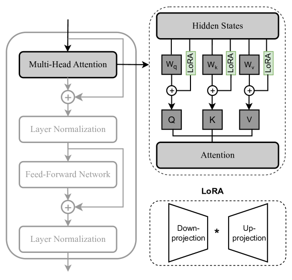
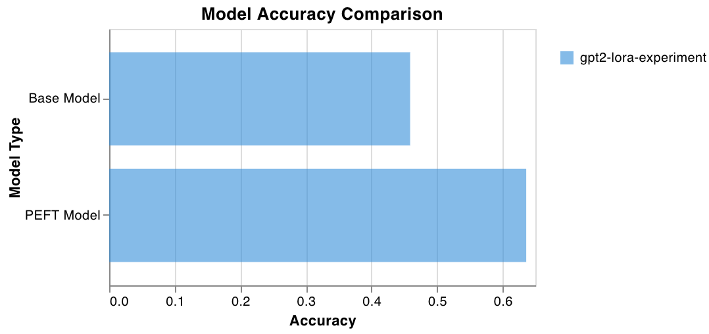

# Medical QA Fine-Tuning with PEFT and LoRA

This project demonstrates how to fine-tune a GPT-2 model for medical question-pair similarity tasks using Hugging Face's PEFT (Parameter-Efficient Fine-Tuning) library and LoRA (Low-Rank Adaptation). The goal is to achieve high performance while keeping the number of trainable parameters minimal.



## Features
- **Lightweight Fine-Tuning**: Uses LoRA to efficiently fine-tune GPT-2 without updating the entire model.
- **Medical QA Dataset**: Processes medical question pairs to train a similarity classifier.
- **Metrics Logging**: Tracks accuracy, F1 score, precision, and recall during training and evaluation.
- **WandB Integration**: Logs training progress and performance metrics to Weights & Biases.
- **Comparison of Models**: Evaluates the performance of the base model and the LoRA-tuned model.

## Workflow

### 1. Dataset Preparation
The medical question-pair dataset is used to train a similarity classifier. This dataset contains pairs of medical questions, where each pair is labeled to indicate whether the questions are semantically similar or not.

### 2. Model Fine-Tuning
- The base GPT-2 model is fine-tuned using LoRA, which updates only a small subset of parameters.
- LoRA configuration includes:
  - Low-rank matrices (`r=8`)
  - Target modules (`c_attn`, `c_proj`)
  - LoRA alpha scaling (`lora_alpha=32`)
  - Dropout to prevent overfitting (`lora_dropout=0.1`)

### 3. Evaluation
The fine-tuned model is evaluated on the validation and test datasets. The following metrics are computed:
- Accuracy
- F1 Score
- Precision
- Recall

### 4. Performance Comparison
The performance of the base model and the LoRA-tuned model is compared. The results are visualized using a bar chart generated in WandB.



## How to Run

### Prerequisites
- Python 3.10.x
- Install required libraries:
  ```bash
  pip install torch transformers datasets peft wandb scikit-learn pandas
  ```

### Steps
1. Clone the repository:
   ```bash
   git clone https://github.com/deepbiolab/gpt2-classification-peft.git
   cd gpt2-classification-peft
   ```
2. Run the training script:
   ```bash
   python main.py
   ```
3. View logs and metrics in WandB.

### Results
After training, the fine-tuned model achieves improved performance compared to the base model while keeping the number of trainable parameters minimal. The comparison chart illustrates the accuracy improvement.

## File Structure
- `main.py`: Main script for training and evaluation.
- `assets/improved_performance.png`: Visualization of model performance comparison.
- `README.md`: Project documentation.

## Key Libraries
- **Hugging Face Transformers**: For model loading and training.
- **PEFT**: Implements parameter-efficient fine-tuning methods like LoRA.
- **WandB**: Logs training metrics and visualizations.
- **Scikit-learn**: Computes evaluation metrics.

## Future Work
- Experiment with different LoRA configurations to optimize performance.
- Apply PEFT techniques to other tasks like text summarization or translation.

## License
This project is licensed under the MIT License. See the `LICENSE` file for details.