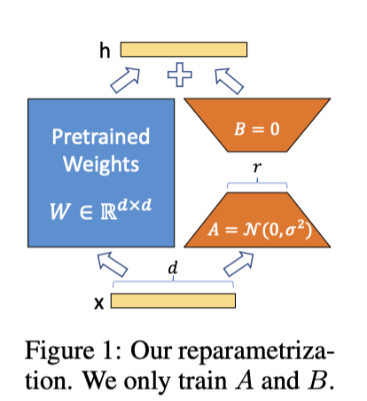

# Exploring Lightweight Fine-Tuning: Enhancing Model Performance with Hugging Face PEFT

In recent years, foundation models have achieved remarkable breakthroughs in areas such as natural language processing and computer vision. However, these models typically have massive parameter sizes, making fine-tuning for specific tasks computationally expensive. To address this issue, lightweight fine-tuning techniques have emerged, enabling efficient adaptation of foundation models while significantly reducing computational resource requirements.

In this report, we delve into how to achieve parameter-efficient fine-tuning using Hugging Face's PEFT (Parameter-Efficient Fine-Tuning) library. By integrating the LoRA (Low-Rank Adaptation) method, we demonstrate the complete workflow from model loading to inference.


## What is PEFT?

PEFT is a technique focused on parameter-efficient fine-tuning, allowing us to optimize models for specific tasks without adjusting all the parameters of the base model. Compared to traditional fine-tuning methods, the core advantages of PEFT include:
1. **Reduced computational resource requirements**: Only a small number of parameters need to be updated.
2. **High flexibility**: Applicable to various deep learning tasks.
3. **Easy model switching**: Quickly load and switch adapters for different tasks.


## Introduction to LoRA

LoRA is a specific implementation of PEFT. Its core idea is to decompose model weights into two low-rank matrices (A and B) and train only these smaller matrices. This approach significantly reduces the number of parameters to be updated while maintaining model performance.



### Common Parameters in LoRA

- **`r`**: The rank of the update matrices; a lower rank means fewer trainable parameters.
- **`target_modules`**: Specifies the modules where LoRA updates should be applied, such as attention layers.
- **`lora_alpha`**: The scaling factor for LoRA, used to control the impact of the update matrices.
- **`bias`**: Determines whether to train bias parameters; options include `'none'`, `'all'`, and `'lora_only'`.
- **`use_rslora`**: Enables Rank-Stabilized LoRA, which improves stability and performance at higher ranks by adjusting the scaling factor.


## Lightweight Fine-Tuning with Hugging Face PEFT

Below is the complete workflow for fine-tuning a GPT-2 model using the Hugging Face PEFT library:

### 1. Load the Pretrained Model

First, we need to load a pretrained base model, such as GPT-2:

```python
from transformers import AutoModelForCausalLM

model = AutoModelForCausalLM.from_pretrained("gpt2")
```

### 2. Create a LoRA Configuration

Next, we create a LoRA configuration object to specify parameters for the fine-tuning process:

```python
from peft import LoraConfig

config = LoraConfig(
    r=8,
    target_modules=["c_attn", "c_proj"],
    lora_alpha=32,
    lora_dropout=0.1,
    bias="none",
    use_rslora=False
)
```

### 3. Convert to a PEFT Model

Use the `get_peft_model()` method to convert the base model into a trainable PEFT model:

```python
from peft import get_peft_model

lora_model = get_peft_model(model, config)
```


### 4. Check Trainable Parameters

Before starting training, you can check the number of trainable parameters with the following code:

```python
lora_model.print_trainable_parameters()
# Example output: trainable params: 294,912 || all params: 124,734,720 || trainable%: 0.236%
```

### 5. Start Training

The converted `lora_model` can be trained like any standard PyTorch or Hugging Face model. Below is a simple training example:

```python
from transformers import Trainer, TrainingArguments

training_args = TrainingArguments(
    output_dir="./results",
    num_train_epochs=3,
    per_device_train_batch_size=8,
    save_steps=10_000,
    save_total_limit=2,
    logging_dir="./logs",
)

trainer = Trainer(
    model=lora_model,
    args=training_args,
    train_dataset=train_dataset,
    eval_dataset=eval_dataset,
)

trainer.train()
```

### 6. Save the Fine-Tuned Model

After training, you can save the adapter weights using the `save_pretrained()` method:

```python
lora_model.save_pretrained("gpt-lora")
```

Note that this will only save the adapter weights, not the entire Transformers model. As a result, the saved file size will be very small.


## Inference and Testing

### Load a Saved PEFT Model

Since we only saved the adapter weights, we need to use PEFT's specialized class to load them:

```python
from peft import AutoPeftModelForCausalLM

lora_model = AutoPeftModelForCausalLM.from_pretrained("gpt-lora")
```

### Text Generation Example

When performing inference with a PEFT model, input IDs should be passed as keyword arguments:

```python
from transformers import AutoTokenizer

tokenizer = AutoTokenizer.from_pretrained("gpt2")
inputs = tokenizer("Hello, my name is", return_tensors="pt")

outputs = lora_model.generate(input_ids=inputs["input_ids"], max_new_tokens=10)
print(tokenizer.batch_decode(outputs))
```


## Advanced Features of LoRA

LoRA provides several practical tools to enhance flexibility and efficiency during fine-tuning:

1. **Merging and Unloading Weights**:
   - Use `merge_and_unload()` to merge adapter weights into the base model, eliminating inference latency.
   - Use `unmerge_adapter()` to separate adapter weights from the base model.

2. **Deleting and Combining Adapters**:
   - Use `delete_adapter()` to remove existing adapters.
   - Use `add_weighted_adapter()` to combine multiple adapters with user-specified weights.

3. **Initialization Options**:
   - By default, weight A is initialized with Kaiming-uniform, and weight B is initialized to zero.
   - Options for Gaussian initialization or LoftQ initialization (suitable for quantized models) are also available.

